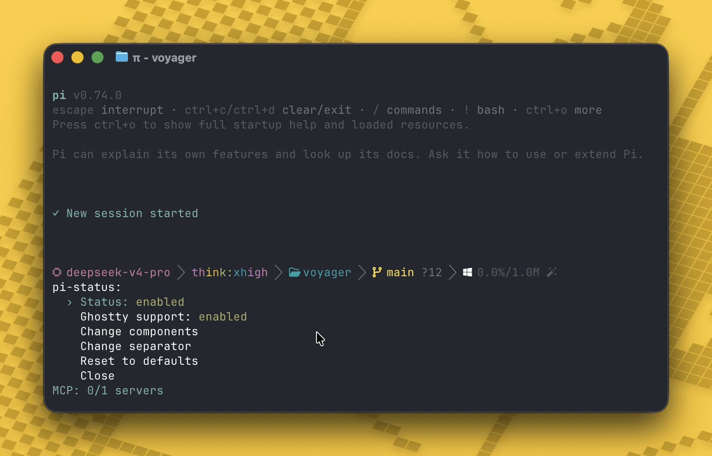
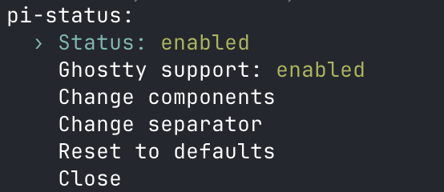

# @thinkscape/pi-status

A [pi](https://github.com/badlogic/pi-mono) extension that shows a **configurable status bar** in the terminal tab title while pi is working, then restores the title when the turn finishes. Also supports **[Ghostty](https://github.com/ghostty-org/ghostty)'s native OSC 9;4 progress bar**. Compatible with all [libghostty](https://ghostty-org-ghostty.mintlify.app/api/overview)-based terminals like [cmux](https://github.com/manaflow-ai/cmux), [muxy](https://github.com/muxy-app/muxy), etc.



## Install

```bash
pi install @thinkscape/pi-status
```

Or test it for one run:

```bash
pi -e @thinkscape/pi-status
```

## Screenshots

### Main menu (`/pi-status`)


### Component picker (`/pi-status components`)




## Commands

Typing `/pi-status` with no arguments opens an **interactive menu** with these actions:

- **Status: enabled/disabled** — toggle pi-status on/off inline (press Enter/Space)
- **Ghostty support: enabled/disabled** — toggle Ghostty OSC 9;4 native progress bar
- **Change components** — open the component picker
- **Change separator** — change the separator character
- **Reset to defaults** — restore the default config
- **Close** — exit the menu

You can also invoke subcommands directly:

```text
/pi-status                open interactive menu
/pi-status status         open interactive menu
/pi-status on             enable pi-status for this session
/pi-status off            disable pi-status for this session
/pi-status ghostty on     enable Ghostty progress bar
/pi-status ghostty off    disable Ghostty progress bar
/pi-status components     open TUI to toggle & reorder status components
/pi-status separator      change the separator character between elements
/pi-status reset          restore default pi-status configuration
```

### `components` TUI

Opens an interactive picker with a **live preview** of the current title at the top. You can:

- **Toggle** components on/off with `Space`
- **Reorder** components with `Ctrl+↑` / `Ctrl+↓`
- **Navigate** the list with `↑` / `↓`
- **Exit** with `Enter` or `Escape`

The order in the list determines the display order in the tab title. Changes are saved immediately.

### Available components

| Component ID    | Description                           | Default |
|-----------------|---------------------------------------|---------|
| `spinner`       | Progress spinner (⠋ ⠙ ⠹ ...)          | on      |
| `pi_symbol`     | π symbol                              | on      |
| `session`       | Session name                          | on      |
| `cwd`           | Working directory basename            | on      |
| `model`         | Current model (e.g., `claude-sonnet-4-5`) | off  |
| `thinking`      | Thinking level (e.g., `high`)         | off     |
| `tokens`        | Context token usage                   | off     |
| `turn`          | Current turn number                   | off     |
| `git_branch`    | Current git branch name               | off     |
| `tools_count`   | Number of active tools                | off     |
| `current_tool`  | Currently executing tool name         | off     |

### `separator`

Prompts for a new separator string (max 5 characters). The separator is placed between each enabled component.

Default: `" - "`

### `reset`

Restores all pi-status configuration to the defaults shown above.

### `ghostty`

Enables or disables Ghostty's native OSC 9;4 progress bar. When enabled:

- **Indeterminate pulse** while the agent is working (`OSC 9;4;3`), refreshed every second like pi's built-in terminal progress
- **Green completion flash** at 100% when the agent finishes (`OSC 9;4;1;100`)
- **Clears on interaction** (`OSC 9;4;0`) when you press a key, focus the terminal, start another agent turn, disable Ghostty support, or shut down pi

Works in Ghostty 1.2+ and any libghostty-based terminals. Enabled **by default**. The extension enables terminal focus reporting while Ghostty support is on and disables it on shutdown/reload.

## Configuration

Settings are stored in pi's settings files under the `piStatus` key:

- `~/.pi/agent/settings.json` (global)
- `.pi/settings.json` (project-local, overrides global)

Example with custom separator and additional components:

```json
{
  "piStatus": {
    "separator": " | ",
    "ghosttySupport": true,
    "components": [
      { "id": "spinner", "enabled": true },
      { "id": "pi_symbol", "enabled": true },
      { "id": "model", "enabled": true },
      { "id": "session", "enabled": true },
      { "id": "cwd", "enabled": true },
      { "id": "thinking", "enabled": true },
      { "id": "git_branch", "enabled": true },
      { "id": "tokens", "enabled": false },
      { "id": "turn", "enabled": false },
      { "id": "tools_count", "enabled": false },
      { "id": "current_tool", "enabled": false }
    ]
  }
}
```

This would produce: `⠋ | π | claude-sonnet-4-5 | my-session | my-project | high | feat/config`

## Environment

Disable the extension by default:

```bash
PI_STATUS_DISABLED=1 pi
```

Accepted truthy values are `1`, `true`, `yes`, and `on`.

## Development

```bash
bun install
bun run check
```

## Releasing

```bash
# Bump version only (patch/minor/major)
bun run version:patch

# Full release: check → bump → commit → tag
bun run release:patch

# Then push the tag to trigger GitHub Actions auto-publish:
git push origin main --tags
```

CI runs on every PR (`bun run check` + dry-run pack). Tag pushes trigger the publish workflow to npm.
